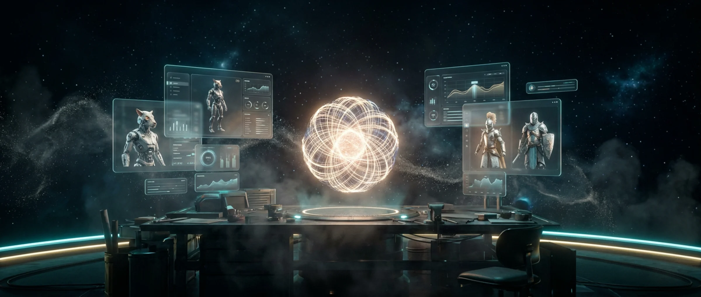
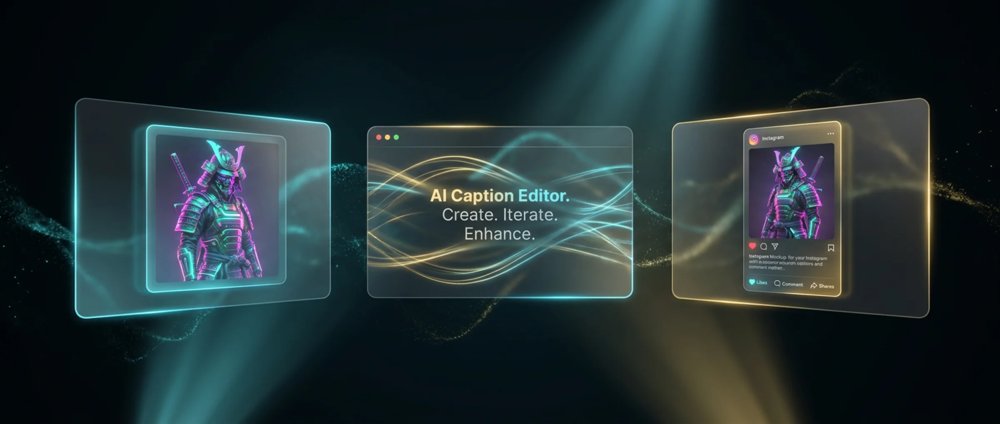

<div align="center">

# 🔥 MashupForge

### Forge art that crosses worlds.

A desktop-first AI studio that takes a single creative spark and ships it
as a fully captioned, scheduled Instagram post — image generation, AI
captions, approval queue, and a smart scheduler wired into one atomic
pipeline.

[**🌐 Landing page**](https://mashupforge.vercel.app) · [**📥 Download v1.0.2**](https://github.com/Code4neverCompany/MashupForge/releases/latest) · [**🎨 Try the studio**](https://mashupforge.vercel.app/studio)



[](./LICENSE)
[](https://github.com/Code4neverCompany/MashupForge/releases)
[](https://nextjs.org)
[](https://react.dev)
[](https://www.typescriptlang.org)
[](https://tauri.app)
[](https://tailwindcss.com)

</div>

---

## ✨ What's in the box

<table>
<tr>
<td width="50%">

### 🧬 Atomic post lifecycle
Every post flows through a state machine that writes the post record and
the hosted image URL in a single transaction. **No more orphaned drafts**
— the v0.9.41 bug is structurally impossible.

</td>
<td width="50%">

### 📅 Smart scheduler
Posts land in your audience's peak-engagement windows. No manual calendar
math, no "I forgot to post on Wednesday" guilt.

</td>
</tr>
<tr>
<td width="50%">

### ✍️ Caption co-pilot
The **MiniMax-M2.7 + OpenAI** chain rewrites for Instagram, X, and
Pinterest from one prompt. Tone, length, hashtag density per platform.

</td>
<td width="50%">

### ✅ Approval queue
Carousel-aware cards, inline caption edits, undo for the 3am brain.
Hit approve, ship it. The reconciler catches drift on next launch.

</td>
</tr>
</table>



## 🏗️ The pipeline

A single idea. **Six states.** Zero lost posts.

```
idle ──▶ image_ready ──▶ pending_caption ──▶ pending_approval
                                                    │
                                          ┌─────────┴─────────┐
                                          ▼                   ▼
                                     approved            rejected
                                          │                   │
                                          ▼                   ▼
                                     scheduled          failed (atomic)
                                          │
                                          ▼
                                       posted
```

| State | Guard |
|---|---|
| `image_ready` → `pending_caption` | `savePostWithBlob()` — atomic write of `(state, hostedImageUrl, blobHash)` |
| `pending_caption` → `pending_approval` | `applyTransition()` — typed, no `any`, all transitions are pure functions |
| `pending_approval` → `scheduled` | `Reconciler` — read-time fix at startup, surfaces drift to the user |
| `scheduled` → `posted` | `SmartScheduler` — peak-window timing, IG Graph API call |

All guards run on **every** API route. The v0.9.41 bug — a post scheduled
without its `hostedImageUrl` — cannot happen here, by construction.

## 🚀 Quick start

### Desktop (recommended)

```bash
# Download the latest installer
# → https://github.com/Code4neverCompany/MashupForge/releases/latest
# Run the .exe, the app auto-updates silently on next launch
```

### Web (no install)

Open **[mashupforge.vercel.app/studio](https://mashupforge.vercel.app/studio)** — same backend, same scheduled queue, no download needed.

### Build from source

**Prerequisites:** Node.js 20+, Rust 1.77+ (for the Tauri shell), `bun` (or npm as fallback).

```bash
# 1. Clone
git clone https://github.com/Code4neverCompany/MashupForge.git
cd MashupForge

# 2. Install
bun install
# or: npm install

# 3. Configure
cp .env.example .env.local
# fill in LEONARDO_API_KEY (image gen) and the text-AI provider you want

# 4. Run the studio
bun run dev              # web at http://localhost:3000/studio
bun run tauri:dev        # desktop shell with hot-reload
bun run tauri:build      # production desktop binary
```

## 🔐 Environment variables

| Variable | Required | Used for |
| --- | :---: | --- |
| `LEONARDO_API_KEY` | ✓ | Image generation (Nano Banana family, GPT Image, etc.) |
| `MINIMAX_API_KEY` | — | Default text AI — caption co-pilot, idea generation |
| `OPENAI_API_KEY` | — | OpenAI fallback in the text-AI chain |
| `ZAI_API_KEY` | — | Z.AI (GLM) — `pi.dev` provider option |
| `ANTHROPIC_API_KEY` | — | Anthropic — `pi.dev` provider option |
| `GOOGLE_API_KEY` | — | Google AI Studio (Gemini) — `pi.dev` provider option |
| `BRAVE_API_KEY` | — | Brave Search (2,000 free queries/month) — trend discovery |
| `INSTAGRAM_ACCOUNT_ID` | — | Business account ID for IG posting |
| `INSTAGRAM_ACCESS_TOKEN` | — | Long-lived Facebook Page Token |
| `TWITTER_*`, `PINTEREST_*`, `DISCORD_*` | — | Optional cross-post targets |

The text-AI chain runs through **`vercel-ai` SDK** with a MiniMax → OpenAI
fallback. You only need to set **one** of the text-AI keys.

## 🧪 Architecture at a glance

```
app/
├── api/                    # 14 routes — every state transition is guarded
│   ├── upload/             # atomic post+hosted-URL write (v0.9.41 fix)
│   ├── ai/{prompt,image,status}
│   ├── social/{post,best-times,instagram-refresh,refresh-token}
│   ├── leonardo{,/-video}/ # image gen + polling
│   ├── mmx/                # multimodal subprocess (image/music/speech/describe)
│   ├── proxy-image/        # allowlisted image proxy
│   ├── trending, web-search, cron/sunday-recap
│   └── ...
├── studio/                 # the studio UI (/studio)
└── login/

components/
├── landing/                # marketing surface — 8 sections, AI-generated art
├── post-lifecycle/         # state machine UI, recovery panel, reconciler
├── pipeline/               # approval queue, status strip
├── platform/               # Instagram + cross-post helpers
└── ...

lib/
├── post-lifecycle/         # the heart — state machine + storage + reconciler
│   ├── lib/                # types, state machine, persistence, reconciler
│   ├── storage/            # IndexedDB (web) + SQLite (desktop) backends
│   ├── migration.ts        # parallel-coexistence bridge from legacy IDB
│   └── index.ts            # public API
├── approval-actions.ts     # planApprove/RejectScheduledPost
├── smart-scheduler.ts      # peak-window posting
├── aiClient.ts             # 2-LLM fallback chain
├── desktop-config-keys.ts  # config.json key registry
└── ...

src-tauri/                  # Tauri 2 desktop shell (Rust)
├── src/lib.rs              # sidecar boot + window.navigate("/studio")
├── tauri.conf.json
├── Cargo.toml
└── frontend-stub/          # production bundle (built from .next/standalone)
```

## 🛠️ Tech stack

- **Desktop shell:** Tauri 2 (Rust) — system tray, autostart, single-instance, signed auto-update
- **Studio UI:** Next.js 16 (Turbopack) + React 19 + TypeScript 6
- **Styling:** Tailwind CSS 4.3 + custom `@theme` palette (Agency Black, Metallic Gold, Electric Blue)
- **Animations:** Motion 12 (formerly Framer Motion)
- **Image AI:** Leonardo.ai v2 (Nano Banana family, GPT Image, custom presets)
- **Text AI:** MiniMax-M2.7 + OpenAI fallback via `vercel-ai` SDK
- **Multimodal:** `mmx` subprocess (image/music/speech/describe) + `nca` text agent
- **Storage:** IndexedDB (web) + SQLite via `tauri-plugin-sql` (desktop)
- **Persistence model:** Real ACID transactions on both backends, parallel-coexistence migration from legacy IDB shape
- **Testing:** Vitest 4 + happy-dom + Testing Library — 1,194 tests, 0 flakes

## 📦 Releases

Latest: **[v1.0.2](https://github.com/Code4neverCompany/MashupForge/releases/tag/v1.0.2)** — desktop `/studio` boot-URL hotfix

| Version | Date | Highlights |
|---|---|---|
| **v1.0.2** | 2026-06-02 | Desktop: navigate to `/studio` after sidecar boot (was loading landing page root → 404) |
| **v1.0.1** | 2026-06-02 | **v0.9.41 production fix** — atomic post+hosted-URL write via the new state machine |
| **v1.0.0** | 2026-06-01 | Initial GA. AGPL-3.0, Tauri 2 shell, signed auto-update channel |

Auto-update is wired: existing users see the update banner on next
launch. `latest.json` is the source of truth for the updater — current
target is `1.0.2`.

## 🧑‍💻 Contributing

We welcome PRs! See **[CONTRIBUTING.md](./CONTRIBUTING.md)** for setup,
code style, and PR guidelines. Bug reports and feature ideas go through
[GitHub Issues](https://github.com/Code4neverCompany/MashupForge/issues)
— templates are under `.github/ISSUE_TEMPLATE/`.

Before opening a PR, run:

```bash
npm run typecheck   # tsc --noEmit, must be clean
npm test            # 1,194 tests, all must pass
npm run build       # bundle budget: 300 KB gzipped first-load JS per route
```

## 📜 License

MashupForge is open source, licensed under the **GNU Affero General
Public License v3.0 or later** (AGPL-3.0-or-later). See
[**`LICENSE`**](./LICENSE) for the full text, or
[gnu.org/licenses/agpl-3.0.html](https://www.gnu.org/licenses/agpl-3.0.html)
for a human-readable summary. The [`NOTICE`](./NOTICE) file lists
third-party attributions.

> **Why AGPL?** The studio is open core. If you fork MashupForge and
> run a hosted version of it as a service, you have to publish your
> changes. That's the protection that lets us keep the source open
> while building a SaaS business on top.

---

<div align="center">

Built by **[4neverCompany](https://4nevercompany.com)** · Agency Black · Metallic Gold · Electric Blue

*"One spark. Six states. Zero lost posts."*

</div>
